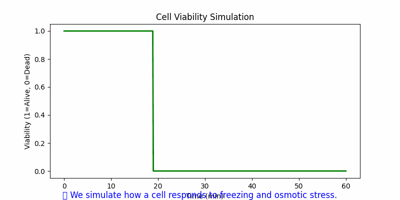

## 🎥 Project Walkthrough (Animated Demo)

# Revive-Bio: Digital Life Restoration Framework

This project explores the possibility of digital and biological resurrection — not as fantasy, but as the scientific pursuit of life extension through cryonics, neural simulation, and AI.

## 🌱 Project Goals
- Simulate cellular viability post-cryopreservation
- Explore brain activity recording for potential revival
- Build AI models to predict successful revival conditions
- Reflect on the philosophical and spiritual meaning of "reviving the dead"

## 📁 Structure
revive-bio/
├── notebooks/
│ ├── cell_viability.ipynb
│ └── brain_data_sim.ipynb
├── src/
│ ├── cryo_model.py
│ └── revive_predictor.py
├── data/
│ └── sample_neural_data.csv
├── philosophy/
│ └── manifesto.md
├── README.md
└── requirements.txt

# 🔮 Vision
Life is precious. Death may not be final. This repository takes the first computational steps toward preserving and restoring life through a blend of biology, machine learning, and metaphysics.
